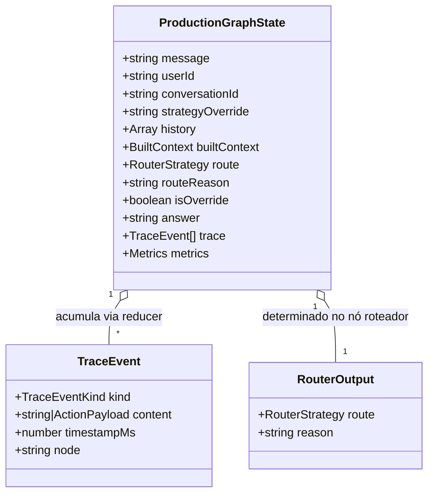

# Data Model: Grafo Unificado de Produção (Production Graph)

**Feature Branch**: `011-production-graph`  
**Date**: 2026-09-09  
**Status**: Completed  

---

## 1. Entidades Principais e Canais de Estado (State Annotation)

O `ProductionGraph` utiliza o modelo de anotação de estado do `@langchain/langgraph` (`Annotation.Root`) para permitir passagem e redução imutável de dados entre os nós.



---

## 2. Definição do Estado do Grafo (`ProductionGraphState`)

```typescript
export const ProductionGraphAnnotation = Annotation.Root({
  /** Mensagem textual original do usuário */
  message: Annotation<string>({
    reducer: (_, b) => b,
    default: () => '',
  }),

  /** Identificador opcional do usuário (para isolamento e memórias semânticas) */
  userId: Annotation<string | undefined>({
    reducer: (_, b) => b,
    default: () => undefined,
  }),

  /** Identificador da conversa para histórico e persistência */
  conversationId: Annotation<string | undefined>({
    reducer: (_, b) => b,
    default: () => undefined,
  }),

  /** Override manual de estratégia fornecido externamente (via HTTP ou CLI) */
  strategyOverride: Annotation<string | undefined>({
    reducer: (_, b) => b,
    default: () => undefined,
  }),

  /** Histórico de mensagens carregado ou fornecido */
  history: Annotation<Array<{ role: 'user' | 'assistant' | 'system'; content: string }>>({
    reducer: (_, b) => b,
    default: () => [],
  }),

  /** Contexto montado pelo ContextBuilder (com orçamentos e podas aplicadas) */
  builtContext: Annotation<BuiltContext | undefined>({
    reducer: (_, b) => b,
    default: () => undefined,
  }),

  /** Estratégia de raciocínio selecionada pelo roteador */
  route: Annotation<'react' | 'plan-and-execute' | 'reflection'>({
    reducer: (_, b) => b,
    default: () => 'react',
  }),

  /** Justificativa operacional do roteador para a escolha */
  routeReason: Annotation<string>({
    reducer: (_, b) => b,
    default: () => '',
  }),

  /** Flag indicando se a rota decorre de override manual */
  isOverride: Annotation<boolean>({
    reducer: (_, b) => b,
    default: () => false,
  }),

  /** Resposta consolidada gerada pela estratégia selecionada */
  answer: Annotation<string>({
    reducer: (_, b) => b,
    default: () => '',
  }),

  /** Trace acumulado de todos os eventos da execução */
  trace: Annotation<TraceEvent[]>({
    reducer: (a, b) => [...a, ...b],
    default: () => [],
  }),

  /** Métricas consolidadas (chamadas LLM, latência, tokens) */
  metrics: Annotation<Metrics>({
    reducer: (a, b) => ({
      ...a,
      ...b,
      llmCalls: (a.llmCalls ?? 0) + (b.llmCalls ?? 0),
      latencyMs: Math.max(a.latencyMs ?? 0, b.latencyMs ?? 0),
    }),
    default: () => ({ llmCalls: 0, latencyMs: 0 }),
  }),
});

export type ProductionGraphState = typeof ProductionGraphAnnotation.State;
```

---

## 3. Modelo do Roteador (`RouterOutput`)

Schema Zod para validação da saída do modelo:

```typescript
export const RouterOutputSchema = z.object({
  route: z.enum(['react', 'plan-and-execute', 'reflection']),
  reason: z.string().min(1, 'A justificativa de rota não pode ser vazia'),
});
```

---

## 4. Evolução do Modelo de Rastreamento (`TraceEvent`)

Em `src/agents/types.ts`:

```typescript
export type TraceEventKind =
  | 'thought'
  | 'action'
  | 'observation'
  | 'plan'
  | 'critique'
  | 'answer'
  | 'route'; // Evento formal de decisão de roteamento

export interface TraceEvent {
  kind: TraceEventKind;
  content: string | ActionPayload;
  timestampMs: number;
  node?: string; // Nome canônico do nó: 'contexto' | 'roteador' | 'react' | 'plan-and-execute' | 'reflection' | 'resposta'
}
```

---

## 5. Mapeamento de Transições de Dados entre Nós

1. `START` → **`contexto`**:
   - Entrada: `message`, `userId`, `conversationId`, `history`.
   - Saída: `builtContext`, métricas de contexto, trace inicial rotulado com `node: 'contexto'`.

2. `contexto` → **`roteador`**:
   - Entrada: `message`, `builtContext`, `strategyOverride`.
   - Saída: `route`, `routeReason`, `isOverride`, evento `kind: 'route'` rotulado com `node: 'roteador'`.

3. **Bordas Condicionais**:
   - `route === 'react'` → nó **`react`**
   - `route === 'plan-and-execute'` → nó **`plan-and-execute`**
   - `route === 'reflection'` → nó **`reflection`**

4. **Nó Executor Selecionado** → **`resposta`**:
   - Entrada: `builtContext`, `route`.
   - Saída: `answer`, trace da estratégia com `node: '<estratégia>'`, métricas acumuladas.

5. **`resposta`** → `END`:
   - Entrada: `answer`, `trace`, `metrics`, `conversationId`.
   - Saída: `ProductionGraphResult` pronto para retorno via HTTP ou uso em testes.
