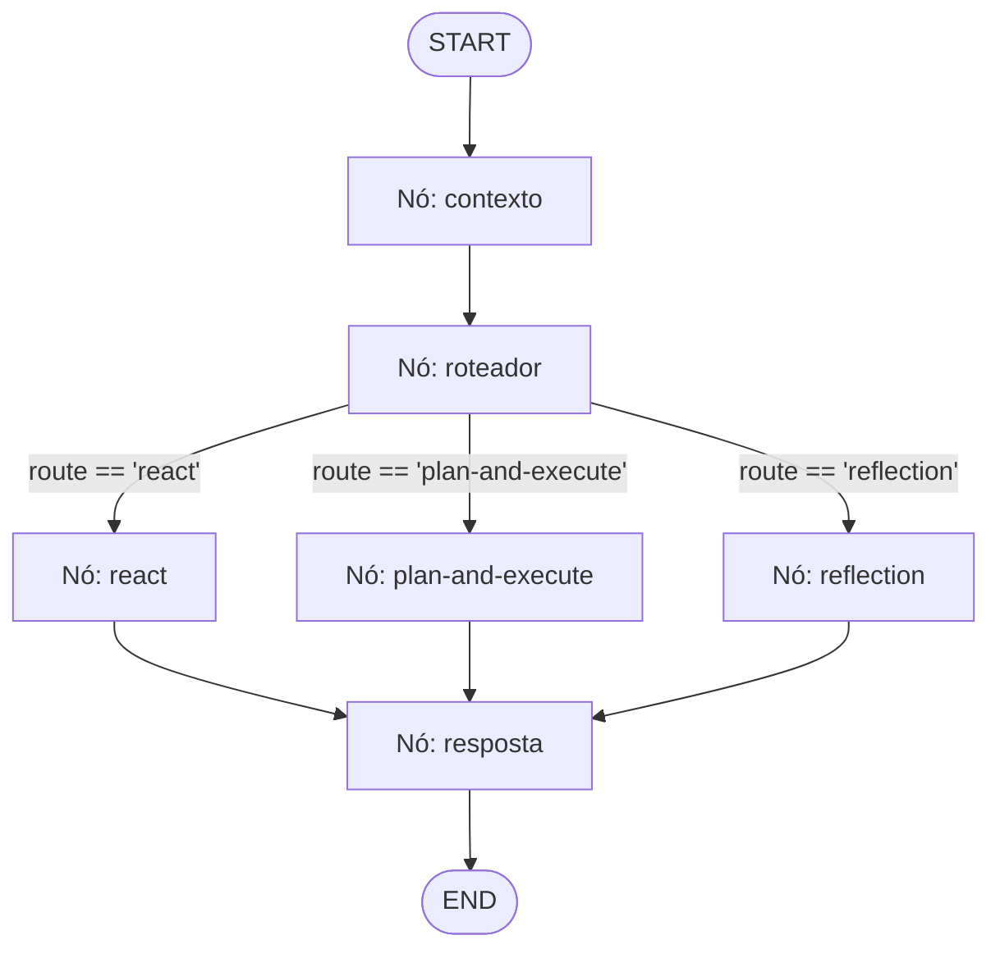

# Research: Grafo Unificado de Produção (Production Graph)

**Feature Branch**: `011-production-graph`  
**Date**: 2026-09-09  
**Status**: Completed  

---

## 1. Visão Geral e Motivação

Atualmente, o OpsPilot possui três estratégias de raciocínio isoladas (`ReActStrategy`, `PlanAndExecuteStrategy` e `ReflectionStrategy`). No servidor HTTP (`src/http/server.ts`), a resolução da estratégia é feita de forma estática com base em uma string no payload (`req.body.strategy`), com padrão hardcoded `'react'`.

Para produção, é necessário um **Grafo Unificado** (`src/agents/production-graph.ts`) orquestrado via **LangGraph (`StateGraph`)** que:
1. Centralize o pipeline completo de execução: injeção de contexto orçado → roteamento inteligente → execução da estratégia adequada → consolidação da resposta final.
2. Tome decisões autônomas de roteamento com saída estruturada (`withStructuredOutput`), utilizando uma matriz/tabela comparativa explícita no prompt de sistema do roteador.
3. Permita override manual transparente através da API HTTP (`POST /chat`), pulando a inferência do roteador caso `strategy` seja enviado explicitamente.
4. Garanta observabilidade granular adicionando a identificação do nó (`node`) a cada evento do trace e registrando o evento formal `route`.

---

## 2. Análise Arquitetural dos Nós do Grafo

O grafo compõe 6 nós organizados em um fluxo de grafo direcionado com ramificação condicional:



### Nó 1: `contexto`
- **Responsabilidade**: Coletar dados da conversa (últimas mensagens da janela), memórias semânticas (se `userId` presente) e resumo consolidado. Executa o `ContextBuilder.build()` com respeito integral aos tetos de `CONTEXT_BUDGET_*`.
- **Efeitos no Estado**: Alimenta `builtContext`, `history` e atualiza `metrics` parciais (`contextBreakdown`, `contextBudgetStats`).
- **Trace**: Se emitir logs de contexto, etiqueta com `node: 'contexto'`.

### Nó 2: `roteador`
- **Responsabilidade**: Avaliar a mensagem de entrada e decidir qual estratégia executar: `'react' | 'plan-and-execute' | 'reflection'`.
- **Mecanismo**:
  - Se `strategyOverride` for fornecido no estado: adota a rota diretamente com `isOverride: true` e não invoca o LLM.
  - Se não houver override: chama `model.withStructuredOutput(RouterOutputSchema)`.
- **Prompt do Roteador**: Deve incluir a seguinte tabela comparativa de critérios operacionais:

| Estratégia | Quando Usar | Vantagens | Trade-offs | Exemplos |
|---|---|---|---|---|
| `react` | Tarefas diretas, perguntas simples, inspeções pontuais de status de serviços ou listagem de alertas ativos. | Menor latência, baixo consumo de tokens, execução ágil. | Não divide tarefas em múltiplos passos encadeados; pode falhar em fluxos interdependentes. | *"Qual o status do auth?", "Liste os alertas firing"* |
| `plan-and-execute` | Tarefas complexas com múltiplos passos dependentes, triagem encadeada, consultas a runbooks seguidas de abertura de incidentes. | Decompõe o problema em plano ordenado, executa passo a passo e replaneja dinamicamente. | Maior consumo de chamadas LLM e maior latência geral. | *"Verifique o gateway, consulte runbook e abra incidente P1 se instável"* |
| `reflection` | Análises críticas de causa raiz (RCA), auditorias de fidelidade factual, validação estrita de evidências operacionais contra alucinações. | Crítico audita se as observações sustentam estritamente as conclusões; revisa respostas duvidosas. | Múltiplos ciclos de execução e crítica; maior custo de tokens. | *"Audite a falha do banco e valide se a evidência sustenta a causa raiz apontada"* |

- **Trace**: Emite evento `kind: 'route'`, `node: 'roteador'`, com `content: "Roteado para [route]: [reason]"` ou indicação de override manual.

### Nós 3, 4 e 5: Estratégias como Nós do Grafo
- **Nó `react`**: Instancia/executa `ReActStrategy` (ou agente ReAct integrado), injetando o contexto montado e etiquetando cada evento de trace (`thought`, `action`, `observation`, `answer`) com `node: 'react'`.
- **Nó `plan-and-execute`**: Executa `PlanAndExecuteStrategy`, mapeando eventos (`plan`, `action`, `observation`, `critique`, `answer`) com `node: 'plan-and-execute'`.
- **Nó `reflection`**: Executa `ReflectionStrategy`, mapeando eventos e críticas com `node: 'reflection'`.

### Nó 6: `resposta`
- **Responsabilidade**: Consolidar a resposta textual final (`answer`), unificar métricas (`llmCalls`, `latencyMs`, `promptTokens`, etc.), e registrar o encerramento do trace com `node: 'resposta'`.

---

## 3. Rastreamento e Observabilidade (Trace & Node)

Para cumprir o requisito `"campo node em todo evento de trace"` e `"evento route"`:
1. `src/agents/types.ts`:
   - `TraceEventKind`: estender com `'route'`.
   - `TraceEvent`: adicionar `node?: string`.
2. Todos os nós do grafo garantem que cada `TraceEvent` emitido preencha `node: '<nome-do-no>'`.
3. Eventos gerados por estratégias internas são normalizados para que herdem o identificador do nó correspondente, evitando eventos órfãos sem `node`.

---

## 4. Integração HTTP e Suporte a Override em `/chat`

No arquivo `src/http/server.ts`:
- O schema Zod `ChatRequestSchema` torna `strategy` opcional:
  ```typescript
  strategy: z.enum(['react', 'plan-and-execute', 'reflection']).optional(),
  ```
- O handler do endpoint `/chat` invoca o `ProductionGraph.run()` passando:
  ```typescript
  {
    message,
    conversationId,
    userId,
    strategyOverride: strategy, // undefined se o cliente não enviar
  }
  ```
- O grafo devolve `answer`, `trace` (com `route` e `node` em todos os passos) e `metrics`.

---

## 5. Decisões de Implementação e Mitigação de Riscos

| Risco / Dúvida | Decisão Técnica |
|---|---|
| Dependência de LLM em testes unitários do grafo | O `ProductionGraph` aceitará parâmetros injetáveis para testes (`model`, estratégias mockadas, `contextBuilder`). |
| Retrocompatibilidade com clientes HTTP antigos | O endpoint continua retornando o mesmo contrato JSON (`answer`, `trace`, `metrics`, `conversationId`), com acréscimo transparente dos novos campos nos traces. |
| Tratamento de erro ou rota desconhecida | Caso a saída estruturada do roteador falhe em runtime, adota-se fallback determinístico para a rota `'react'` registrando aviso no trace. |
