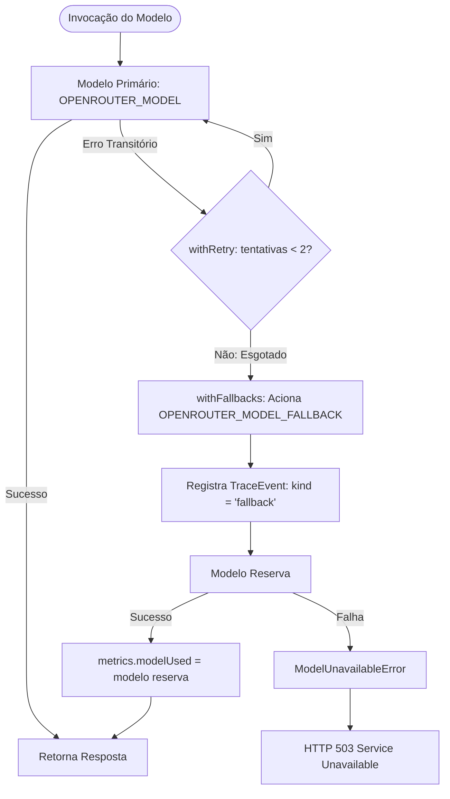

# Data Model: Resiliência de Modelo com Fallback e Retries

**Feature**: `012-model-fallback`  
**Date**: 2026-09-10  

---

## 1. Diagrama de Fluxo e Transição de Resiliência



---

## 2. Entidades de Dados e Tipos

### 2.1 Extensão de `TraceEvent` (`src/agents/types.ts`)

```typescript
export type TraceEventKind =
  | 'thought'
  | 'action'
  | 'observation'
  | 'plan'
  | 'critique'
  | 'answer'
  | 'route'
  | 'fallback'; // NOVO

export interface TraceEvent {
  kind: TraceEventKind;
  type?: string;
  content: string | ActionPayload;
  timestampMs: number;
  node?: string;
  route?: string;
  reason?: string;
  // Campos específicos para eventos kind = 'fallback':
  fromModel?: string;
  toModel?: string;
  error?: string;
}
```

### 2.2 Extensão de `Metrics` (`src/agents/types.ts`)

```typescript
export interface Metrics {
  llmCalls: number;
  latencyMs: number;
  modelUsed?: string; // NOVO: Modelo que atendeu a chamada com sucesso
  historyMessages?: number;
  recalledMemories?: number;
  promptTokens?: number;
  completionTokens?: number;
  totalTokens?: number;
  contextBreakdown?: ContextBreakdown;
  contextBudgetStats?: ContextBudgetStats;
}
```

### 2.3 Modelo de Erro HTTP 503 (`Service Unavailable`)

Quando ambos os modelos falharem, o endpoint `/chat` responde com:
- **HTTP Status**: `503`
- **JSON Body**:
  ```json
  {
    "error": "Service Unavailable",
    "message": "Todos os modelos (primário e fallback) falharam ao processar a requisição",
    "primaryModel": "openrouter/free",
    "fallbackModel": "meta-llama/llama-3-8b-instruct:free"
  }
  ```

---

## 3. Configuração de Variáveis de Ambiente (`.env`)

| Variável | Obrigatória? | Padrão | Descrição |
|---|---|---|---|
| `OPENROUTER_API_KEY` | Sim | - | Chave de autenticação da OpenRouter |
| `OPENROUTER_MODEL` | Sim | `openrouter/free` | Modelo de linguagem primário |
| `OPENROUTER_MODEL_FALLBACK` | Não (recomendada) | `meta-llama/llama-3-8b-instruct:free` | Modelo de contingência acionado após esgotamento de retries |
| `OPENROUTER_MAX_RETRIES` | Não | `2` | Número máximo de tentativas no modelo primário |
