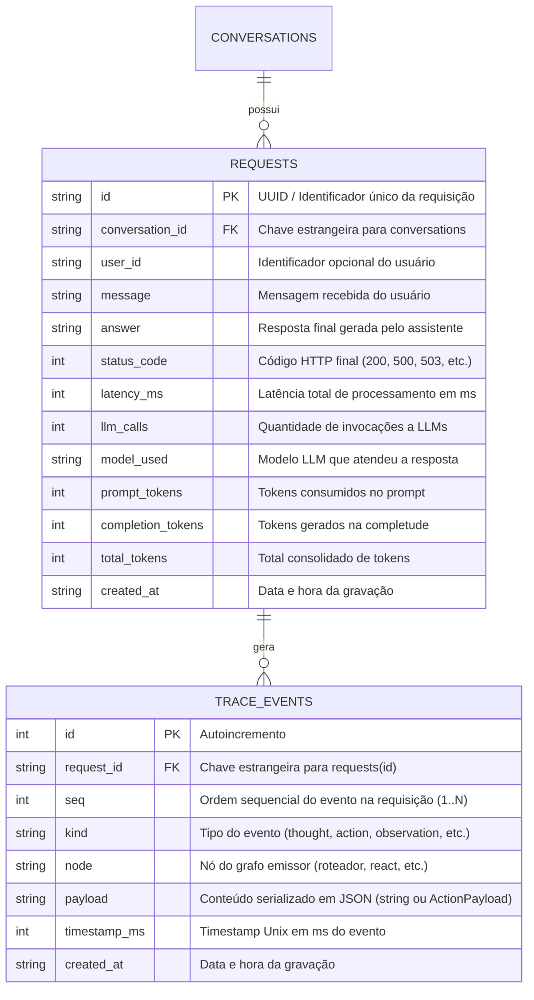

# Data Model: Persistência de Trace e Logs Estruturados em JSON

**Feature**: `013-trace-persistence`  
**Date**: 2026-09-10  
**Status**: Completed  

---

## 1. Diagrama Entidade-Relacionamento (ERD)



---

## 2. Tabelas e Definições de DDL

### 2.1. Tabela `requests`

Armazena as requisições atendidas pela API, guardando os parâmetros principais de auditoria e todas as métricas consolidadas.

| Coluna | Tipo SQLite | Nulo? | Descrição |
|---|---|---|---|
| `id` | `TEXT` | NÃO (PK) | Identificador único (`requestId`). Ex: UUID v4. |
| `conversation_id` | `TEXT` | NÃO | Identificador da conversa vinculada. |
| `user_id` | `TEXT` | SIM | Identificador do usuário se fornecido na requisição. |
| `message` | `TEXT` | NÃO | Texto da mensagem de entrada do usuário. |
| `answer` | `TEXT` | SIM | Resposta textual gerada para o usuário (nulo em caso de erro prematuro). |
| `status_code` | `INTEGER` | NÃO | Código HTTP de retorno (ex: 200, 500, 503). |
| `latency_ms` | `INTEGER` | SIM | Duração total do processamento do agente em milissegundos. |
| `llm_calls` | `INTEGER` | SIM | Contagem de invocações a modelos de linguagem. |
| `model_used` | `TEXT` | SIM | Identificador do modelo LLM efetivamente utilizado. |
| `prompt_tokens` | `INTEGER` | SIM | Total de tokens do prompt consumidos. |
| `completion_tokens` | `INTEGER` | SIM | Total de tokens de completion gerados. |
| `total_tokens` | `INTEGER` | SIM | Total de tokens (prompt + completion). |
| `created_at` | `TEXT` | NÃO | Timestamp UTC padrão ISO/SQLite (`datetime('now')`). |

### 2.2. Tabela `trace_events`

Armazena individualmente cada passo, reflexão, ferramenta e evento intermediário gerado pela estratégia de raciocínio do agente durante a requisição.

| Coluna | Tipo SQLite | Nulo? | Descrição |
|---|---|---|---|
| `id` | `INTEGER` | NÃO (PK) | Chave primária autoincrementada. |
| `request_id` | `TEXT` | NÃO (FK) | Referência para `requests(id)` com `ON DELETE CASCADE`. |
| `seq` | `INTEGER` | NÃO | Número de sequência ordenado da emissão do evento (1, 2, 3...). |
| `kind` | `TEXT` | NÃO | Tipo do evento: `'thought'`, `'action'`, `'observation'`, `'plan'`, `'critique'`, `'answer'`, `'route'`, `'fallback'`. |
| `node` | `TEXT` | SIM | Nome do nó do grafo (ex: `'roteador'`, `'react'`, `'planejador'`). |
| `payload` | `TEXT` | NÃO | JSON serializado com o conteúdo do evento (`string` ou `ActionPayload` + metadados). |
| `timestamp_ms` | `INTEGER` | NÃO | Timestamp Unix em milissegundos da emissão do evento. |
| `created_at` | `TEXT` | NÃO | Timestamp de inserção no banco de dados. |

---

## 3. Interfaces de Domínio e Store (`TraceStore`)

```typescript
export interface RequestRecord {
  id: string;
  conversationId: string;
  userId?: string;
  message: string;
  answer?: string;
  statusCode: number;
  latencyMs?: number;
  llmCalls?: number;
  modelUsed?: string;
  promptTokens?: number;
  completionTokens?: number;
  totalTokens?: number;
  createdAt?: string;
}

export interface TraceEventRecord {
  id?: number;
  requestId: string;
  seq: number;
  kind: string;
  node?: string;
  content: string | Record<string, unknown>;
  timestampMs: number;
  createdAt?: string;
}

export interface RequestWithTrace {
  request: RequestRecord;
  trace: TraceEventRecord[];
}

export interface TraceStore {
  saveRequest(record: RequestRecord, trace: TraceEvent[]): void;
  getRequest(id: string): RequestWithTrace | null;
}
```

---

## 4. Estrutura do Log JSON (`src/obs/logger.ts`)

Cada entrada emitida pelo logger para `stdout` segue rigorosamente o formato de 1 linha física de JSON com metadados:

```json
{
  "timestamp": "2026-09-10T22:30:00.123Z",
  "level": "info",
  "requestId": "550e8400-e29b-41d4-a716-446655440000",
  "event": "trace_event",
  "seq": 1,
  "kind": "thought",
  "node": "roteador",
  "durationMs": 140,
  "metadata": {
    "route": "react"
  }
}
```
