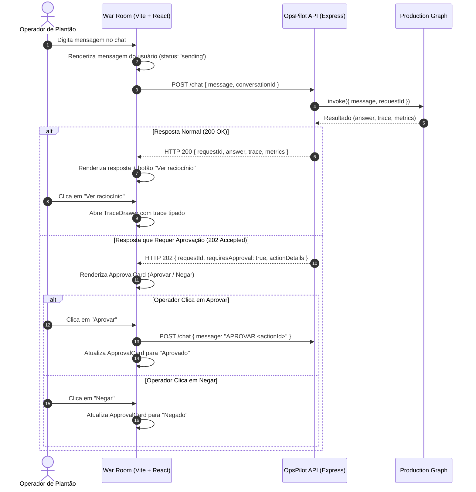

# Data Model: War Room Web OpsPilot

**Feature**: `014-war-room-web`  
**Date**: 2026-09-11

---

## 1. Entidades da Interface Web

### 1.1 `ChatMessage`
Representa um turno de diálogo exibido no feed da War Room.

| Campo | Tipo | Descrição |
|---|---|---|
| `id` | `string` (UUID) | Identificador local único da mensagem. |
| `sender` | `'user' \| 'assistant' \| 'system'` | Emissor da mensagem. |
| `text` | `string` | Conteúdo principal da mensagem. |
| `timestamp` | `number` | Timestamp em milissegundos da criação. |
| `requestId` | `string?` | Identificador de correlação do backend (`X-Request-Id`). |
| `conversationId` | `string?` | UUID da conversa mantida pelo `ConversationStore`. |
| `status` | `'sending' \| 'success' \| 'error' \| 'awaiting_approval' \| 'approved' \| 'rejected'` | Estado do processamento da mensagem. |
| `trace` | `TraceEventRecord[]?` | Array de eventos intermediários do raciocínio. |
| `metrics` | `MessageMetrics?` | Métricas de latência, modelo e contagem de tokens. |
| `approval` | `ApprovalDetails?` | Dados da ação quando status for 202 / aprovação pendente. |

### 1.2 `MessageMetrics`
| Campo | Tipo | Descrição |
|---|---|---|
| `latencyMs` | `number?` | Tempo total de execução do agente no servidor em ms. |
| `promptTokens` | `number?` | Quantidade de tokens enviados no prompt. |
| `completionTokens` | `number?` | Quantidade de tokens gerados na resposta. |
| `totalTokens` | `number?` | Soma total dos tokens. |
| `modelUsed` | `string?` | Nome do modelo LLM que atendeu a requisição. |

### 1.3 `ApprovalDetails`
Estrutura renderizada no cartão interativo de status 202.

| Campo | Tipo | Descrição |
|---|---|---|
| `actionId` | `string` | Identificador único da proposta de ação. |
| `actionName` | `string` | Nome da ação (ex: `restart_service`, `clear_cache`). |
| `service` | `string` | Nome do serviço afetado. |
| `severity` | `'low' \| 'medium' \| 'high' \| 'critical'` | Nível de risco da ação proposta. |
| `summary` | `string` | Justificativa do agente para a execução. |
| `params` | `Record<string, unknown>?` | Parâmetros adicionais da ação. |
| `decision` | `'pending' \| 'approved' \| 'rejected'` | Decisão do operador humano. |
| `decidedAt` | `number?` | Timestamp da decisão do operador. |

### 1.4 `TraceEventRecord`
Espelha o contrato de persistência do backend (`src/store/trace-store.ts`).

| Campo | Tipo | Descrição |
|---|---|---|
| `seq` | `number` | Sequência ordinal do evento dentro da requisição. |
| `node` | `string?` | Nome do nó do grafo (`router`, `agent`, `tools`, `reflect`). |
| `kind` | `string` | Natureza do evento (`thought`, `call`, `response`, `route`). |
| `payload` | `unknown` | Conteúdo bruto do evento (parâmetros de tools, saída ou raciocínio). |
| `timestampMs` | `number` | Timestamp em milissegundos da ocorrência do evento. |

### 1.5 `AppConfig`
Configurações locais da aplicação web armazenadas no `localStorage`.

| Campo | Tipo | Padrão | Descrição |
|---|---|---|---|
| `apiBaseUrl` | `string` | `http://localhost:3000` | URL do servidor OpsPilot. |
| `theme` | `'dark' \| 'light' \| 'system'` | `'system'` | Tema da interface. |

---

## 2. Diagrama de Fluxo de Dados (Mermaid)

