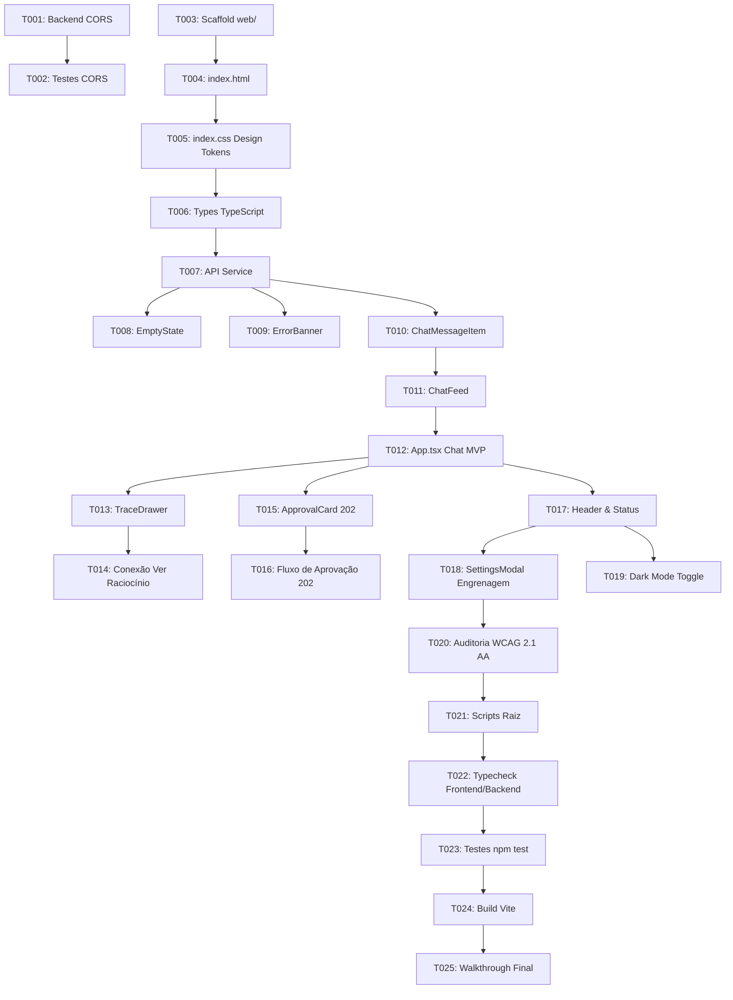

# Tasks: War Room Web OpsPilot (Vite + React + TS)

**Feature**: `014-war-room-web`  
**Date**: 2026-09-11  
**Spec**: [spec.md](./spec.md) | **Plan**: [plan.md](./plan.md)

---

## Phase 1: Setup & Backend CORS (Foundational)

**Purpose**: Habilitar a comunicação entre o frontend web e o backend Express via CORS, além de preparar o scaffold do projeto em `web/`.

- [x] T001 [P] Adicionar middleware nativo de CORS em `src/http/server.ts` com liberação de origens locais, preflight `OPTIONS` (204 No Content), cabeçalhos permitidos (`Content-Type`, `X-Request-Id`, `Authorization`) e exposição do header `X-Request-Id`
- [x] T002 [P] Escrever testes de integração de CORS em `src/http/server.test.ts` validando requisições `OPTIONS` e cabeçalhos de resposta CORS
- [x] T003 [P] Criar a estrutura base do frontend em `web/` com `web/package.json` (React, ReactDOM, Vite, TypeScript), `web/tsconfig.json`, `web/tsconfig.node.json` e `web/vite.config.ts` com `base: '/opspilot/'`
- [x] T004 [P] Criar o arquivo `web/index.html` com metadados semânticos, título "OpsPilot War Room", container raiz `#root` e suporte a tema

**Checkpoint**: Backend preparado para aceitar requisições do frontend com CORS e estrutura inicial em `web/` configurada.

---

## Phase 2: Design System Tokens & Base CSS (`.github/instructions/designn.instrucions.md`)

**Purpose**: Implementar a fundação visual do Design System estritamente aderente às diretrizes de design do repositório.

- [x] T005 Implementar `web/src/index.css` com a tabela completa de tokens semânticos (modos claro e escuro), escala de espaçamento de 4px/8px (`--space-1` a `--space-16`), escala tipográfica em `rem`, anel de foco visível (`:focus-visible`) e suporte a `@media (prefers-reduced-motion: reduce)`
- [x] T006 [P] Criar os contratos e tipos TypeScript em `web/src/types/chat.ts` (`ChatMessage`, `TraceEventRecord`, `RequestRecord`, `ApprovalDetails`, `MessageMetrics`) e `web/src/types/config.ts` (`AppConfig`)
- [x] T007 Implementar o cliente HTTP em `web/src/services/api.ts` com baseURL dinâmica (lida de `localStorage`), injeção/leitura de `X-Request-Id`, tratamento de timeout e suporte a status HTTP 202

**Checkpoint**: Design tokens ativos, tipos definidos e camada de serviço HTTP pronta.

---

## Phase 3: User Story 1 - Conversação e Chat da War Room (Priority: P1) 🎯 MVP

**Goal**: Permitir que o operador interaja com o OpsPilot através de um chat em tempo real conectado a `POST /chat`, com histórico contínuo por `conversationId` e feedback de carregamento.

**Independent Test**: Acessar `http://localhost:5173/opspilot/`, visualizar o Empty State com prompts rápidos, enviar uma mensagem e receber a resposta formatada do assistente com métricas e preservação de `conversationId`.

### Components & UI
- [x] T008 [P] [US1] Implementar componente `web/src/components/EmptyState.tsx` com mensagem acolhedora, ícone de terminal (`aria-hidden="true"`), descrição de ajuda e botões rápidos de ação (sugestões de prompt)
- [x] T009 [P] [US1] Implementar componente `web/src/components/ErrorBanner.tsx` com mensagem descritiva de falha de conexão/servidor e botão de ação de retry
- [x] T010 [US1] Implementar componente `web/src/components/ChatMessageItem.tsx` com renderização de turnos de usuário e assistente, formatação de blocos de texto/código, badge de status e rodapé com tempo de resposta e tokens
- [x] T011 [US1] Implementar componente `web/src/components/ChatFeed.tsx` com listagem de mensagens, rolagem automática suave e indicador de digitação (*typing/loading indicator*)
- [x] T012 [US1] Implementar o componente principal `web/src/App.tsx` integrando o feed de mensagens, campo de entrada com envio por `Enter`, chamada a `POST /chat` e armazenamento de `conversationId`

**Checkpoint**: Chat funcional conectado ao backend com empty state, loading e histórico de conversa.

---

## Phase 4: User Story 2 - Inspeção de Raciocínio e Trace Tipado ("Ver raciocínio") (Priority: P1)

**Goal**: Permitir ao operador clicar em "Ver raciocínio" em qualquer mensagem do assistente para abrir uma gaveta lateral (*drawer*) acessível exibindo o trace tipado e detalhado da execução.

**Independent Test**: Enviar uma mensagem que dispare ferramentas e nós do grafo, clicar no botão "Ver raciocínio", verificar a abertura do drawer lateral com a sequência ordenada de eventos (`TraceEventRecord`), payloads colapsáveis e fechamento via tecla `Escape`.

### Components & UI
- [x] T013 [US2] Implementar componente `web/src/components/TraceDrawer.tsx` com comportamento de gaveta lateral modal (`role="dialog"`, `aria-modal="true"`), linha do tempo cronológica com nós do grafo (`router`, `agent`, `tools`, `reflect`), latência, tokens, payload JSON colapsável e suporte a fechamento por clique fora ou `Escape`
- [x] T014 [US2] Conectar o botão *"Ver raciocínio"* em `web/src/components/ChatMessageItem.tsx` e `web/src/App.tsx` para passar os eventos do trace da mensagem e abrir o `TraceDrawer` correspondente

**Checkpoint**: Inspeção de raciocínio com trace tipado totalmente integrada e acessível.

---

## Phase 5: User Story 3 - Intervenção Human-in-the-Loop: Status 202 com Cartão de Aprovar/Negar (Priority: P1)

**Goal**: Respostas do backend que retornem status HTTP 202 (Accepted) ou ações de mitigação pendentes de autorização humana devem ser renderizadas como um cartão de Aprovar/Negar interativo.

**Independent Test**: Simular ou disparar uma ação que responda HTTP 202, validar a renderização do cartão com botões destacados de aprovação e rejeição, clicar em "Aprovar" e constatar a atualização imediata do cartão para o estado aprovado.

### Components & UI
- [x] T015 [US3] Implementar componente `web/src/components/ApprovalCard.tsx` com destaque visual de severidade (alerta/atenção), resumo da ação, parâmetros afetados e botões de ação *"Aprovar Ação"* e *"Negar Ação"* com foco acessível
- [x] T016 [US3] Integrar o tratamento de respostas HTTP 202 em `web/src/services/api.ts` e `web/src/App.tsx`, convertendo a resposta em um item de aprovação e gerenciando a transição de estado após decisão do operador

**Checkpoint**: Cartão de Aprovar/Negar operacional para requisições 202 de segurança.

---

## Phase 6: User Story 4 & 5 - Configuração via Engrenagem, Dark Mode e Acessibilidade (Priority: P2)

**Goal**: Fornecer modal de configurações no cabeçalho para ajuste da URL da API OpsPilot, alternância fluida entre tema Claro/Escuro e validação completa de acessibilidade WCAG 2.1 AA.

**Independent Test**: Clicar na engrenagem no header, alterar a URL da API para outro valor, salvar e recarregar a página para confirmar a persistência em `localStorage`. Alternar tema e validar contraste e foco com `Tab`.

### Components & UI
- [x] T017 [P] [US4] Implementar componente `web/src/components/Header.tsx` contendo o logotipo "OpsPilot War Room", indicador visual de status da API (Online/Offline), botão de alternar tema claro/escuro e botão com ícone de engrenagem
- [x] T018 [P] [US4] Implementar modal `web/src/components/SettingsModal.tsx` com campo para edição da URL base da API (`opspilot_api_url`), botão para testar conectividade via `GET /stats` e persistência no `localStorage`
- [x] T019 [P] [US5] Implementar toggle de tema em `web/src/App.tsx` com sincronização automática do atributo `data-theme` no elemento `<html>` e persistência sob a chave `opspilot_theme` no `localStorage`
- [x] T020 [US5] Realizar auditoria de acessibilidade garantindo navegação por teclado (`Tab`, `Shift+Tab`, `Enter`, `Escape`), anéis de foco `:focus-visible` e atributos ARIA nos modais e drawer

**Checkpoint**: Cabeçalho, modal de configurações da API, dark mode e acessibilidade validados.

---

## Phase 7: Polish, Quality Gates & Verification

**Purpose**: Integrar scripts no `package.json` raiz, validar compilação estrita e testes automatizados.

- [x] T021 Atualizar `package.json` da raiz para incluir scripts de execução e build do frontend (`web:dev`, `web:build`, `web:typecheck`)
- [x] T022 Executar a checagem de tipos do frontend (`npm run typecheck` em `web/`) e do backend (`npm run typecheck` na raiz)
- [x] T023 Executar os testes automatizados do backend (`npm test`) validando que todos continuam verdes
- [x] T024 Validar o build de produção do frontend (`npm run build` em `web/`) gerando os assets otimizados com `base: '/opspilot/'`
- [x] T025 Atualizar o walkthrough e documentação final de validação
- [ ] T023 Executar os testes automatizados do backend (`npm test`) validando que todos continuam verdes
- [ ] T024 Validar o build de produção do frontend (`npm run build` em `web/`) gerando os assets otimizados com `base: '/opspilot/'`
- [ ] T025 Atualizar o walkthrough e documentação final de validação

---

## Dependencies & Execution Order

