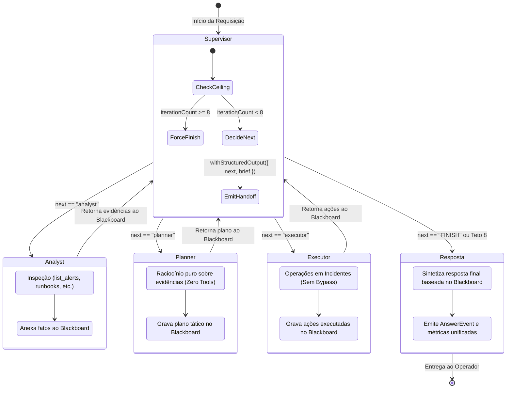

# Data Model & State Transitions: Modo Equipe (Team Mode)

**Feature**: `017-team-mode`  
**Date**: 2026-09-11  
**Status**: Completed  

---

## 1. Esquemas de Dados e Contratos Zod

### 1.1 Decisão Estruturada do Supervisor (`SupervisorDecision`)

```typescript
import { z } from 'zod';

export const supervisorDecisionSchema = z.object({
  next: z
    .enum(['analyst', 'planner', 'executor', 'FINISH'])
    .describe("Próximo especialista a assumir a tarefa ou 'FINISH' se o trabalho da equipe foi concluído."),
  brief: z
    .string()
    .min(1, 'O brief de orientação não pode ser vazio')
    .describe('Instrução direta e objetiva para o especialista ou resumo de conclusão para o operador.'),
});

export type SupervisorDecision = z.infer<typeof supervisorDecisionSchema>;
```

### 1.2 Estrutura do Blackboard (`Blackboard`)

```typescript
export interface Blackboard {
  /** Demanda ou incidente original relatado pelo usuário */
  task: string;
  /** Fatos objetivos, métricas e alertas coletados pelo Analista */
  findings: string[];
  /** Plano tático de intervenção elaborado pelo Planejador */
  plan?: string;
  /** Histórico de mutações de incidentes realizadas pelo Executor */
  actions: string[];
  /** Estado operacional do ciclo de atendimento */
  status: 'triaging' | 'planning' | 'executing' | 'completed' | 'exhausted';
}
```

### 1.3 Evento de Trace `Handoff`

```typescript
import type { TraceEventKind } from '../agents/types.js';

export interface HandoffPayload {
  from: 'supervisor' | 'analyst' | 'planner' | 'executor';
  to: 'analyst' | 'planner' | 'executor' | 'supervisor' | 'FINISH';
  brief: string;
  iteration: number;
}

export interface HandoffTraceEvent {
  node: string;
  kind: 'handoff';
  type: 'handoff';
  content: string;
  timestampMs: number;
  from: string;
  to: string;
  brief: string;
  iteration: number;
}
```

---

## 2. Anotação de Estado do Grafo (`TeamAnnotation`)

Definição formal com o `@langchain/langgraph`:

```typescript
import { Annotation } from '@langchain/langgraph';
import type { TraceEvent, Metrics } from '../agents/types.js';
import type { BuiltContext } from '../context/context-builder.js';

export const TeamAnnotation = Annotation.Root({
  task: Annotation<string>({
    reducer: (_, b) => b,
    default: () => '',
  }),
  history: Annotation<Array<{ role: 'user' | 'assistant' | 'system'; content: string }>>({
    reducer: (_, b) => b,
    default: () => [],
  }),
  builtContext: Annotation<BuiltContext | undefined>({
    reducer: (_, b) => b,
    default: () => undefined,
  }),
  blackboard: Annotation<Blackboard>({
    reducer: (curr, update) => ({
      ...curr,
      ...update,
      findings: [...(curr.findings || []), ...(update.findings || [])],
      actions: [...(curr.actions || []), ...(update.actions || [])],
    }),
    default: () => ({
      task: '',
      findings: [],
      actions: [],
      status: 'triaging',
    }),
  }),
  next: Annotation<string>({
    reducer: (_, b) => b,
    default: () => 'supervisor',
  }),
  brief: Annotation<string>({
    reducer: (_, b) => b,
    default: () => '',
  }),
  iterationCount: Annotation<number>({
    reducer: (curr, add) => (add === 0 ? 0 : curr + add),
    default: () => 0,
  }),
  trace: Annotation<TraceEvent[]>({
    reducer: (curr, newEvents) => [...curr, ...newEvents],
    default: () => [],
  }),
  answer: Annotation<string>({
    reducer: (_, b) => b,
    default: () => '',
  }),
  metrics: Annotation<Metrics>({
    reducer: (curr, upd) => ({
      ...curr,
      ...upd,
      llmCalls: (curr.llmCalls || 0) + (upd.llmCalls || 0),
      latencyMs: (curr.latencyMs || 0) + (upd.latencyMs || 0),
    }),
    default: () => ({ llmCalls: 0, latencyMs: 0 }),
  }),
});

export type TeamState = typeof TeamAnnotation.State;
```

---

## 3. Máquina de Estados e Fluxo de Execução



---

## 4. Regras de Transição e Validação de Estado

1. **Iniciação**: O nó `supervisor` é acionado primeiro com `iterationCount = 0` e inicializa o `blackboard.task` com a mensagem de entrada.
2. **Avaliação do Teto**:
   - `iterationCount` incrementa em $+1$ no início de cada execução do nó `supervisor`.
   - Se `iterationCount >= 8`:
     - O supervisor bypassa a chamada do LLM se necessário ou força a decisão para `next: 'FINISH'`.
     - O status é setado para `status: 'exhausted'`.
     - Um evento `handoff` de encerramento por limite de turnos é injetado no trace.
3. **Pós-Especialista**: Todo especialista (`analyst`, `planner`, `executor`), ao concluir seu turno, atualiza sua seção no `blackboard` e possui transição direta de volta para o nó `supervisor`.
4. **Finalização**: Quando `next === 'FINISH'`, a transição condicional direciona para o nó final que consolida a resposta para o usuário.
